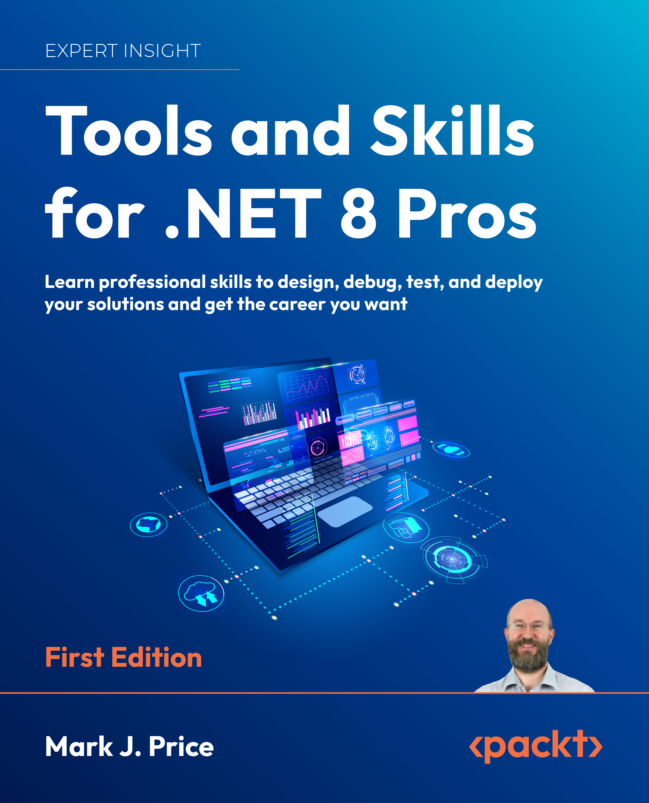

> **IMPORTANT!** [Common Mistakes, Improvements, and Errata aka list of corrections](docs/errata/README.md)

# Tools and Skills for .NET 8 Pros, First Edition

Repository for the Packt Publishing book titled "Tools and Skills for .NET 8 Pros" by Mark J. Price

If you have purchased the paperback or Kindle edition, then you can request a free PDF copy at the following link: https://www.packtpub.com/page/free-ebook.

My author page on Amazon: https://www.amazon.com/Mark-J-Price/e/B071DW3QGN/ 

All of my books on Packt's website: https://subscription.packtpub.com/search?query=mark+j.+price

My author page on Goodreads: https://www.goodreads.com/author/show/14224500.Mark_J_Price

## Chapters and code solutions

> **Warning!** Chapters subject to change before publication.

**Introduction**
- Chapter 1 Introducing Tools and Skills for .NET Professionals [code/Chapter01](code/Chapter01)

**Tools**
- Chapter 2 Making the Most of the Tools in your Code Editor: [code/Chapter02](code/Chapter02)
- Chapter 3 Source Code Control and Management Using Git: [code/Chapter03](code/Chapter03)
- Chapter 4 Debugging Tools and Techniques: [code/Chapter04](code/Chapter04)
- Chapter 5 Tools for Memory Troubleshooting: [code/Chapter05](code/Chapter05)

**Skills**
- Chapter 6 Documenting Your Code: [code/Chapter06](code/Chapter06)
- Chapter 7 Observing and Modifying Code Execution Dynamically: [code/Chapter07](code/Chapter07)
- Chapter 8 Protecting Data and Apps Using Cryptography: [code/Chapter08](code/Chapter08)
- Chapter 9 Building a Custom GPT-based Chat Service: [code/Chapter09](code/Chapter09)

**Testing**
- Chapter 10 Dependency Injection, Containers and Service Lifetime: [code/Chapter10](code/Chapter10)
- Chapter 11 Unit Testing and Mocking [code/Chapter11](code/Chapter11)
- Chapter 12 Integration and System Testing: [code/Chapter12](code/Chapter12)
- Chapter 13 Benchmarking Performance, Load, and Stress Testing: [code/Chapter13](code/Chapter13)
- Chapter 14 Testing Websites, Services, and Mobile Apps: [code/Chapter14](code/Chapter14)

**Deployment**
- Chapter 15 Hosting with Docker and Containerization: [code/Chapter15](code/Chapter15)
- Chapter 16 Cloud-Native Development Using .NET Aspire: [code/Chapter16](code/Chapter16)
- Chapter 17 Continuous Integration and Delivery with Deployment Pipelines: [code/Chapter17](code/Chapter17)

**Design**
- Chapter 18 Exploring Common Design Patterns for .NET: [code/Chapter18](code/Chapter18)
- Chapter 19 Implementing Common Algorithms and Data Structures: [code/Chapter19](code/Chapter19)
- Chapter 20 Introducing Software Architecture: [code/Chapter20](code/Chapter20)

**Interviews**
- Chapter 21 Preparing for an Interview: [code/Chapter20](code/Chapter20)

## Code solutions for Visual Studio 2022 and Visual Studio Code

[Figures for all of the code solution folders](docs/ch01-solution-folders.md).

Visual Studio Code now has an extension named **C# Dev Kit** that includes a solution explorer so it can better work with Visual Studio 2022 solution files. Visual Studio 2022 for Windows, Visual Studio 2022 for Mac, and Visual Studio Code + C# Dev Kit can now use the same code solution files and projects for each chapter, found here: [/code](/code). 

> **For Visual Studio Code:** To use the chapter solution files with Visual Studio Code, install the **C# Dev Kit** extension. Then in Visual Studio Code, open the `ChapterNN` folder that contains a `ChapterNN.sln` solution file and wait for the **SOLUTION EXPLORER** pane to appear at the bottom of the **EXPLORER**. You can drag and drop to reorder the panes to put **SOLUTION EXPLORER** at the top. Learn more about C# Dev Kit at the following link: https://devblogs.microsoft.com/visualstudio/announcing-csharp-dev-kit-for-visual-studio-code/

> **Warning!** If you use both Visual Studio 2022 and Visual Studio Code to open these solutions, be aware that the build process can conflict. This is because Visual Studio 2022 has its own non-standard build server that is different from the standard build server used by .NET SDK CLI. My recommendation is to only have a solution open in one code editor at any time. You should also clean the solutions between opening in different code editors. For example, after closing the solution in one code editor, I delete the `bin` and `obj` folders before then opening in a different code editor.

## Bonus content

The appendix and color figures are available to download as PDFs:

- Appendix A, Answers to the Test Your Knowledge Questions: coming May 2024.
- Color images of the screenshots/diagrams used in this book: coming May 2024.

## Important

Corrections for typos and other mistakes and improvements like refactoring code. Useful links to other related material. 

- [Command-Lines](docs/command-lines.md) page lists all commands as a single line that can be copied and pasted to make it easier to enter commands at the prompt.
- [Book Links](docs/book-links.md)
- [Common Mistakes, Improvements, and Errata aka list of corrections](docs/errata/README.md)
- [First edition's support for .NET 9](docs/dotnet9.md)

## Microsoft Certifications

Announcing the New Foundational C# Certification with freeCodeCamp:
https://devblogs.microsoft.com/dotnet/announcing-foundational-csharp-certification/

Microsoft used to have professional exams and certifications for developers that covered skills like C# and ASP.NET. Sadly, they have retired them all. These days, the only developer-adjacent exams and certifications are for Azure or Power Platform, as you can see from the certification poster: https://aka.ms/traincertposter

## Microsoft .NET community support

- [.NET Developer Community](https://dotnet.microsoft.com/platform/community)
- [.NET Tech Community Forums for topic discussions](https://techcommunity.microsoft.com/t5/net/ct-p/dotnet)
- [Q&A for .NET to get your questions answered](https://learn.microsoft.com/en-us/answers/products/dotnet)
- [Technical questions about the C# programming language](https://learn.microsoft.com/en-us/answers/topics/dotnet-csharp.html)
- [If you'd like to apply to be a reviewer](https://authors.packtpub.com/reviewers/)

## Interviews with me

Podcast interviews with me:

- [The .NET Core Podcast - March 3, 2023](https://dotnetcore.show/episode-117-our-perspectives-on-the-future-of-net-with-mark-j-price/)
- [Yet Another Podcast with Jesse Liberty - December 2022](https://jesseliberty.com/2022/12/10/mark-price-on-c-11-fixed/)
- [The .NET Core Podcast - February 4, 2022](https://dotnetcore.show/episode-91-c-sharp-10-and-dotnet-6-with-mark-j-price/)
- [Yet Another Podcast with Jesse Liberty - May 2021](http://jesseliberty.com/2021/05/16/mark-price-on-c9-and-net-6/)
- [The .NET Core Podcast - February 7, 2020](https://dotnetcore.show/episode-44-learning-net-core-with-mark-j-price/)
- [Yet Another Podcast with Jesse Liberty - February 2020](http://jesseliberty.com/2020/02/23/mark-price-c-net-core/)
- [Packt Podcasts](https://soundcloud.com/packt-podcasts/csharp-8-dotnet-core-3-the-evolution-of-the-microsoft-ecosystem)

Written interviews with me:
- [C# 9 and .NET 5: Book Review and Q&A](https://www.infoq.com/articles/book-interview-mark-price/?itm_source=infoq&itm_campaign=user_page&itm_medium=link)
- [Q&A with Episerver's Mark J. Price, author of C# 9 and .NET 5 - Modern Cross-Platform Development](https://www.episerver.com/articles/q-and-a-with-mark-price)
